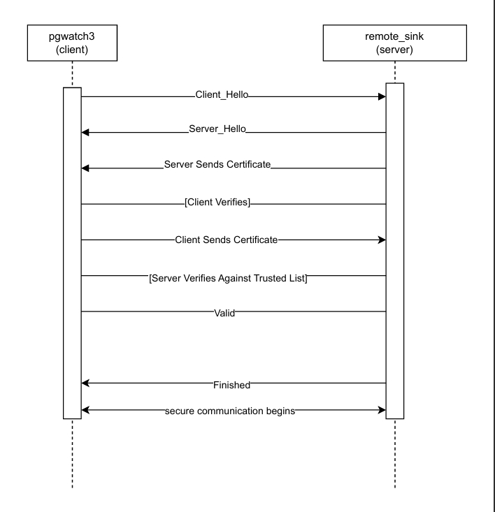

# Setup Instructions for rpc_server and rpc_client with mTLS Authentication Flow
These instructions allow you to run the `rpc_server` and `rpc_client` either directly on your local machine (localhost) or using Docker (locally built or pulled from Docker Hub).
Showing how the basic mTLS authentication process works in a rpc network.

## Image Representation of RPC AUTH FLOW


## 1. Running with Docker
Follow these steps to run the `rpc_server` and `rpc_client` using Docker with mTLS authentication.

### Prerequisites
- Ensure Docker is installed and running.
- Navigate to the `rpc_echo/` directory where `certs/` and `.env` will be located:
  ```
  cd rpc_echo/
  ```
- **create a network:**
If the network already exists, you can skip this step or remove it with `docker network rm rpc_network` before recreating it.
```
docker network create rpc_network
```
- **generate certicates:**
Use OpenSSL to generate the CA, server, and client certificates, and place them in the `certs/` directory
```
mkdir -p certs
cd certs
```
**Create a CA (valid for 30 days)**
```
openssl req -x509 -new -nodes -keyout ca.key -out ca.crt -days 30 -subj "/CN=my-ca"
```
- **Generate Server Certificate (valid for 30 days with SAN for rpc_network)**
```
openssl req -new -newkey rsa:4096 -nodes -keyout server.key -out server.csr -subj "/CN=rpc_server"
openssl x509 -req -in server.csr -CA ca.crt -CAkey ca.key -CAcreateserial -out server.crt -days 30 -extfile <(printf "subjectAltName=DNS:rpc_server")
rm server.csr
```
- **Generate Client Certificate (valid for 30 days)**
```
openssl req -new -newkey rsa:4096 -nodes -keyout client.key -out client.csr -subj "/CN=client"
openssl x509 -req -in client.csr -CA ca.crt -CAkey ca.key -CAcreateserial -out client.crt -days 30
rm client.csr  
```
- **Return to the `rpc_echo/` directory:**
```
cd ..
```
### Environment File Setup
Create a `.env` file in the `rpc_echo/` directory with the following variables:
- For Docker:
    ```
    RPC_HOST=rpc_server
    RPC_PORT=8443
    ```
These variables tell the client where to connect and the server which port to listen on.
- **Pull images from Docker hub:**
```
docker pull uloamaka/rpc_server:latest
docker pull uloamaka/rpc_client:latest
```

- **Run the Server:**
```
docker run --name rpc_server --network rpc_network --env-file $(pwd)/.env -v $(pwd)/certs:/certs -e DOCKER_ENV=true uloamaka/rpc_server:latest
```
Note: Run this in one terminal. Alternatively, run in the background with -d:
```
docker run --name rpc_server --network rpc_network --env-file .env -v $(pwd)/certs:/certs -e DOCKER_ENV=true -d uloamaka/rpc_server:latest
```

- **Run the Client:**
  In a second terminal (from rpc_echo/):
```
docker run --name rpc_client --network rpc_network --env-file $(pwd)/.env -v $(pwd)/certs:/certs -e DOCKER_ENV=true 
  uloamaka/rpc_client:latest
```
- **Server output:**
```
 🔐 mTLS Server running on port:8443 (mTLS enabled)
```
- **Client output:**
```
RPC Response: {Result:Hello, Secure RPC Client! Error:}
```
confirms that authentication was succesful and communication can flow.

## 2. Run the server and client directly on your machine without Docker.
- **Generate Certificates**
Use OpenSSL to generate the CA, server, and client certificates, and place them in the `certs/` directory 
```bash
mkdir -p certs
cd certs
```
- **Create a CA for Localhost (valid for 30 days)**
```
openssl req -x509 -new -nodes -keyout ca.key -out ca.crt -days 30 -subj "/CN=my-ca"
```
- **Generate Server Certificate (valid for 30 days with SAN for localhost)**
```
openssl req -new -newkey rsa:4096 -nodes -keyout server.key -out server.csr -subj "/CN=localhost"
openssl x509 -req -in server.csr -CA ca.crt -CAkey ca.key -CAcreateserial -out server.crt -days 30 -extfile <(printf "subjectAltName=DNS:localhost")
rm server.csr
```
- **Generate Client Certificate (valid for 30 days)**
```
openssl req -new -newkey rsa:4096 -nodes -keyout client.key -out client.csr -subj "/CN=client"
openssl x509 -req -in client.csr -CA ca.crt -CAkey ca.key -CAcreateserial -out client.crt -days 30
rm client.csr  # Clean up CSR
```
### Environment File Setup
Create a `.env` file in the `rpc_echo/` directory with the following variables:
- For Localhost:
    ```
    RPC_HOST=localhost
    RPC_PORT=8443
    ```
These variables tell the client where to connect and the server which port to listen on.

- **Build and run Server:**
Navigate to the `rpc_server/` directory:
```
go build -o rpc_server main.go
./rpc_server
```
**Alternatively:**
```
go run main.go
```
- **Build and run Client:**
Navigate to the `rpc_client/` directory:

```
go build -o rpc_client main.go
./rpc_client
```
**Alternatively:**
```
go run main.go
```
